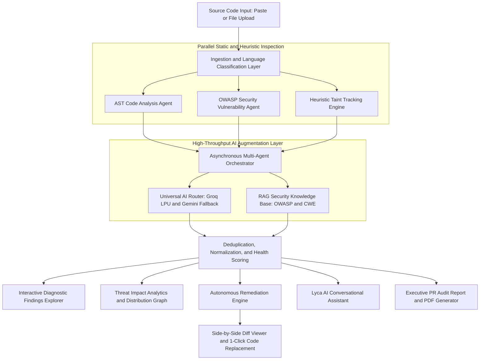

# Aegis AI: Multi-Agent Code Inspection and Security Analysis Platform

[](https://fastapi.tiangolo.com)
[](https://react.dev)
[](https://vitejs.dev)
[](https://www.python.org)
[](https://tailwindcss.com)
[](https://www.docker.com)
[](LICENSE)

An enterprise-grade, multi-agent artificial intelligence platform designed to automate Static Application Security Testing (SAST), detect structural code smells, analyze data flow via heuristic taint tracking, and execute autonomous one-click remediation. Driven by deterministic Abstract Syntax Tree (AST) analyzers, OWASP Top 10 rule engines, and high-throughput Large Language Models (LLMs), the platform delivers sub-second security evaluations, interactive side-by-side diffs, context-aware conversational pair programming, and publication-ready Pull Request audit documentation.

---

## Production Deployments

* **Production Web Application**: [https://ai-code-review-security-analysis-ag.vercel.app](aegisyn.vercel.app)
* **API Documentation**: Available at `/docs` (Swagger UI) and `/redoc` (ReDoc) on backend endpoints.

---

## Multi-Agent Architecture and Pipeline

The platform utilizes a decoupled, asynchronous pipeline where specialized autonomous agents collaborate sequentially and in parallel to inspect, evaluate, and remediate submitted source code.



---

## Order of Operations: Multi-Agent Execution Flow

### Phase 1: Ingestion, Lexing, and Syntax Validation
When source code is uploaded or pasted into the editor, the platform performs lexical syntax verification and classifies the language (Python, Java, JavaScript, TypeScript, C++, C, SQL). Invalid syntax structures are caught before execution to prevent downstream parsing failures.

### Phase 2: Parallel Static AST and Security Heuristics
* **Code Analysis Agent**: Parses the Concrete Syntax Tree (utilizing Python `ast` and language-specific grammar matchers) to compute complexity metrics, identify "God Functions" (>50 lines), excessive parameter lists (>5 arguments), mutable default arguments, dead code, and broad exception suppression.
* **Security Vulnerability Agent**: Executes heuristic pattern scans mapped against the OWASP Top 10:2021 database and CWE / SANS Top 25 standards:
  * **SQL Injection (CWE-89)**: Detects dynamic string concatenations, f-string queries, and unescaped database inputs.
  * **OS Command Injection (CWE-78)**: Identifies raw shell execution calls (`os.system`, `subprocess` with `shell=True`, `Runtime.getRuntime().exec`).
  * **Hardcoded Credentials and Secrets (CWE-798)**: Identifies plaintext passwords, high-entropy API tokens, private keys, and authorization secrets.
  * **Insecure Deserialization (CWE-502)**: Flags unsafe serialization loaders (`pickle.loads`, `yaml.load`).
  * **Arbitrary Code Execution (CWE-95)**: Highlights dynamic interpretation calls (`eval`, `exec`).
  * **Cross-Site Scripting - XSS (CWE-79)**: Detects unescaped DOM writes (`innerHTML`, unescaped `render_template_string`).
  * **Security Misconfigurations (CWE-16)**: Flags insecure debug settings (`DEBUG = True`), disabled SSL verification (`verify = False`), and wildcard hosts.
  * **Exception Handling Deficiencies (CWE-391)**: Locates bare `except:` blocks that suppress runtime failures.
* **Heuristic Taint Tracking Engine**: Maps the data flow from untrusted input sources (`request.args`, `getParameter`, `sys.argv`) directly into critical sinks.

### Phase 3: High-Throughput AI Semantic Augmentation
The system invokes an Asynchronous Universal AI Router with strict connection pooling (`httpx.AsyncClient`) and circuit-breaker protection:
* **Primary**: Groq Cloud running Llama 3.3 70B / Llama 3.1 8B Instant (800+ tokens per second) for near-instant responses.
* **Fallback**: Google Gemini 2.0 Flash / 1.5 Flash via REST endpoints for deep contextual code reasoning.

### Phase 4: Finding Normalization and Code Health Scoring
Findings are merged, deduplicated, and scored using a deterministic formula:

$$\text{Code Health Score} = \max\left(0, 100 - (25 \times \text{Critical}) - (15 \times \text{High}) - (5 \times \text{Medium}) - (2 \times \text{Low})\right)$$

The score assigns a project quality category:
* **Clean and Secure (80 to 100)**: Minor or negligible warnings.
* **Moderate Quality (50 to 79)**: Maintainability issues or medium-severity security warnings.
* **Critical Attention (0 to 49)**: Severe vulnerabilities, exploitable injection vectors, or hardcoded secrets.

### Phase 5: Autonomous Code Remediation
* Produces production-ready, refactored code eliminating 100% of detected vulnerabilities.
* Injects required secure dependencies (`import os`, `import subprocess`, `import ast`, `import logging`, `from markupsafe import escape`).
* Replaces raw secrets with `os.getenv()` or `System.getenv()`, binds database queries with parameterized statements, converts shell calls to safe list-based `subprocess.run(..., check=True)`, and upgrades unsafe deserializers to `yaml.safe_load()`.

### Phase 6: Interactive Pair Programming (Lyca AI)
An integrated Conversational Assistant backed by Retrieval-Augmented Generation (RAG) and loaded with the full context of the uploaded code, line-by-line findings, and OWASP documentation. It answers developer questions, explains vulnerabilities, and suggests custom refactoring patterns.

### Phase 7: PR Summary and Audit Report Generation
Compiles an executive summary including risk distributions, time-to-remediate estimates, structured mitigation checklists, and automated PDF export functionality for formal pull request audits.

---

## Web Application Features and User Interface

| Component | Feature | Functional Description |
| :--- | :--- | :--- |
| **Code Studio** | Multi-Language Editor | Integrated syntax-highlighting code editor with line numbering, automatic language detection, and sample vulnerability presets. |
| **Code Studio** | Clipboard and File Ingestion | One-click clipboard import or drag-and-drop file upload supporting `.py`, `.java`, `.js`, `.ts`, `.cpp`, `.c`, and `.sql`. |
| **Diagnostic Results** | Code Health Score Radial Gauge | Visual circular gauge providing an immediate 0 to 100 health index with defect counts, blocker tallies, and estimated fix times. |
| **Diagnostic Results** | Threat Distribution Analytics | Interactive Recharts Bar Chart mapping defect frequency, impact scores, and cause percentages. Includes clickable bars for inline root cause callouts. |
| **Diagnostic Results** | Interactive Findings Explorer | Severity-filtered finding cards (All, Critical, High, Medium, Low) displaying line numbers, defect explanations, remediation actions, and before/after snippets. |
| **Remediation** | One-Click Code Remediation | Global `/fix-all` engine generating a fully patched, compilable codebase resolving all identified flaws. |
| **Remediation** | Side-by-Side Diff Viewer | Split-screen visual diff comparing original code against remediated code with line-by-line additions and deletions. |
| **Assistant** | Lyca AI Chatbot | Context-aware security pair programmer with support for Floating Popup, Split Screen (docked 50% width), and Fullscreen modes. |
| **Reporting** | PDF Audit Report Export | Browser-native formal report generator compiling executive overviews, defect breakdowns, root cause analyses, patched code, and compliance sign-offs into printable PDF format. |
| **History** | Scan History and Persistence | LocalStorage-backed scan repository (`aegis_ai_history_v1`) supporting real-time search, language filters, risk filters, sorting, and one-click scan restoration. |
| **Agents Pipeline** | Execution Pipeline Visualization | Live agent status indicators (Code Analysis Agent, Security Agent, Remediation Agent) with pipeline stage tracking. |
| **Agents Pipeline** | Live Execution Terminal | Real-time simulated terminal log tracing internal orchestrator decisions, model routing, and AST evaluation steps. |
| **Design System** | Dual Theme Support | Persistent Glassmorphism Dark Mode and Clean Light Mode with automatic theme memory and transient intro notification. |

---

## Vulnerability and Compliance Matrix

| OWASP Standard | CWE Reference | Classification | Detection Technique | Automated Mitigation |
| :--- | :--- | :--- | :--- | :--- |
| **A01: Broken Access Control** | CWE-22, CWE-918 | Path Traversal / SSRF | Pattern Heuristics and Semantic Analysis | Input sanitization, path boundary enforcement, and IP verification |
| **A02: Cryptographic Failures** | CWE-327, CWE-798 | Weak Hashes (MD5, SHA-1), Plaintext Keys | AST Assignment Matcher and Entropy Scanning | SHA-256 upgrade and environment variable extraction (`os.getenv`) |
| **A03: Injection** | CWE-89, CWE-78, CWE-95 | SQLi, OS Command Injection, Arbitrary Eval | Taint Flow Tracking and AST Call Analysis | Parameterized queries (`PreparedStatement`), `subprocess.run(list, check=True)`, elimination of `eval` |
| **A05: Security Misconfiguration** | CWE-16 | Debug Mode Enabled, Disabled SSL (`verify=False`) | Heuristic Flag Inspection | `DEBUG = False`, `verify = True`, explicit allowed host configuration |
| **A07: Identification and Auth** | CWE-798 | Hardcoded Database Passwords, API Tokens | Static Token and Constant Scanner | Externalization to environment variables or secret management services |
| **A08: Software and Data Integrity** | CWE-502 | Insecure Deserialization (`pickle`, `yaml.load`) | AST Dangerous Sink Matcher | Migration to `yaml.safe_load()` and structured `json.loads()` |
| **A09: Logging and Monitoring** | CWE-391 | Bare `except:` Clauses, Silent Exception Swallowing | AST Try-Except Block Analyzer | Replacement with `except Exception as e:` and structured `logging.error()` |

---

## Technology Stack

### Frontend
* **Core Framework**: React 18 with Vite for optimized client-side bundling.
* **Styling and Tokens**: Tailwind CSS 3.4 coupled with bespoke CSS glassmorphism design tokens.
* **Visualization and Charts**: Recharts (ResponsiveContainer, BarChart, PieChart, Tooltip).
* **Code Formatting**: PrismJS syntax highlighting and ReactMarkdown for rich text rendering.
* **Typography and Icons**: Google Fonts (Space Grotesk, Inter, JetBrains Mono) and Material Symbols.

### Backend
* **API Framework**: FastAPI (Python 3.11+) running on an asynchronous Uvicorn ASGI server.
* **Data Validation**: Pydantic v2 strict models for all request and response schemas.
* **Static Analysis**: Python standard `ast`, custom regex lexers, Radon for cyclomatic complexity, and Bandit security linters.
* **Vector Store and RAG**: ChromaDB embedding store containing OWASP Top 10 guidelines and CWE taxonomies.
* **Relational Persistence**: SQLAlchemy 2.0 with PostgreSQL 16 (production) and aiosqlite (local/demo).
* **Authentication and Security**: Passlib (Bcrypt hashing), Python-Jose (JWT generation and validation).

### AI and LLM Orchestration
* **Groq Cloud**: Llama 3.3 70B Versatile and Llama 3.1 8B Instant via REST API for sub-second responses.
* **Google Gemini**: Gemini 2.0 Flash / Gemini 1.5 Flash via REST API endpoints for deep semantic security evaluations.
* **Resilience Layer**: Universal AI Router with asynchronous connection pooling, provider blacklisting, and circuit-breaking fallbacks.

---

## API Reference

The backend provides high-performance REST endpoints configured with CORS support:

| Method | Endpoint | Request Body | Description |
| :--- | :--- | :--- | :--- |
| `POST` | `/analyze/text` | `{"code": "...", "language": "python", "filename": "..."}` | Executes complete multi-agent analysis on raw source code. |
| `POST` | `/analyze/file` | `multipart/form-data (file: UploadFile)` | Accepts multi-language source file uploads for security scanning. |
| `POST` | `/fix-all` | `{"code": "...", "language": "python", "findings": [...]}` | Produces a fully refactored, secure codebase resolving all findings. |
| `POST` | `/remediate` | `{"finding": {...}, "code": "...", "language": "..."}` | Returns isolated remediation details and code fixes for a single finding. |
| `POST` | `/chat` | `{"question": "...", "context_code": "...", "context_findings": [...], "conversation_history": [...]}` | Context-aware conversational AI assistant queries with message memory. |
| `POST` | `/pr-summary` | `{"analysis_result": {...}, "filename": "...", "language": "..."}` | Generates an executive PR audit report and remediation roadmap. |
| `POST` | `/rag/query` | `{"question": "...", "context": "..."}` | Queries the vector knowledge base for OWASP and CWE reference data. |
| `GET` | `/health` | None | Service heartbeat and uptime validation endpoint. |

---

## Repository Structure

```text
.
|-- ai_code_review/
|   |-- agents/
|   |   |-- code_analysis_agent.py   # AST parsing, code smells, complexity metrics
|   |   |-- orchestrator.py          # Asynchronous multi-agent execution pipeline
|   |   |-- pr_summary_agent.py      # Executive audit summary and metrics generator
|   |   |-- remediation_agent.py     # Deterministic and LLM refactoring engine
|   |   `-- security_vuln_agent.py   # OWASP Top 10 and CWE vulnerability scanner
|   |-- knowledge_base/              # OWASP standards and CWE reference documentation
|   |-- modules/
|   |   |-- rag_pipeline.py          # Vector retrieval-augmented generation engine
|   |   |-- submission.py            # Input validation and language classification
|   |   `-- taint_tracker.py         # Heuristic source-to-sink data flow tracer
|   |-- main.py                      # Primary FastAPI microservice API server
|   |-- requirements.txt             # Python backend dependencies
|   `-- verify.py                    # 25-test automated regression verification suite
|
|-- backend/                         # Enterprise backend application
|   |-- agents/                      # Distributed agent wrappers
|   |-- api/                         # FastAPI route modules (auth, reviews, submissions, chat)
|   |-- core/                        # Configuration, database, and security utilities
|   |-- models/                      # SQLAlchemy database models
|   |-- rag/                         # ChromaDB vector knowledge base and seeder
|   |-- Dockerfile                   # Backend Docker container specification
|   |-- main.py                      # Enterprise FastAPI application entry point
|   `-- requirements.txt             # Backend dependencies
|
|-- frontend/                        # Client-side user interface
|   |-- src/
|   |   |-- api/
|   |   |   `-- client.js            # Axios and Fetch API client for backend integration
|   |   |-- styles/
|   |   |   `-- index.css            # Tailwind directives and glassmorphism styling
|   |   |-- App.jsx                  # Master UI component, state management, and tab views
|   |   `-- main.jsx                 # React DOM application entry point
|   |-- Dockerfile                   # Frontend Nginx container specification
|   |-- package.json                 # Frontend dependencies and scripts
|   `-- vite.config.js               # Vite bundler configuration
|
|-- samples/                         # Security benchmark test files
|   |-- 1_basic_injection.py         # SQL injection, command injection, plaintext secret
|   |-- 2_complex_auth.java          # Java SQL concatenation, constant credentials
|   `-- 3_advanced_vulns.py          # Insecure YAML loading, SSRF, XSS templates
|
|-- docs/                            # Architectural specifications and milestone reports
|   |-- Milestone4_Project_Report.md
|   |-- Project_Technical_Report.md
|   `-- Volume-01-Project-Foundation.md
|
|-- docker-compose.yml               # Multi-container orchestration (Postgres, Chroma, Backend, Frontend)
|-- LICENSE                          # MIT Open-Source License
`-- README.md                        # Master project documentation
```

---

## Local Setup and Installation

### Prerequisites
* **Python**: Version 3.11 or higher
* **Node.js**: Version 18.0 or higher (with npm)
* **Docker & Docker Compose**: Optional, for multi-container orchestration

### 1. Repository Configuration
Clone the repository and prepare your environment configuration:

```bash
git clone https://github.com/Rafi0496/AI-Code-Review-Security-Analysis-Agent.git
cd AI-Code-Review-Security-Analysis-Agent
```

Create a `.env` file in the project root:

```env
GROQ_API_KEY=your_groq_api_key_here
GEMINI_API_KEY=your_gemini_api_key_here
DATABASE_URL=sqlite+aiosqlite:///./codereview.db
SECRET_KEY=generate_a_secure_random_key
```

### 2. Backend Installation and Execution

Navigate to the backend directory and set up a Python virtual environment:

```bash
python -m venv venv
# On Windows (PowerShell):
.\venv\Scripts\Activate.ps1
# On Linux/macOS:
source venv/bin/activate

pip install -r ai_code_review/requirements.txt
```

Launch the FastAPI backend server:

```bash
uvicorn ai_code_review.main:app --host 127.0.0.1 --port 8000 --reload
```

The API will be available at `http://127.0.0.1:8000`, with interactive documentation at `http://127.0.0.1:8000/docs`.

### 3. Frontend Installation and Execution

In a separate terminal, install dependencies and start the Vite development server:

```bash
cd frontend
npm install
npm run dev
```

The web application will open at `http://localhost:5173`.

### 4. Full-Stack Docker Deployment

To launch the complete infrastructure (PostgreSQL database, ChromaDB vector store, FastAPI backend, and React client) using Docker Compose:

```bash
docker compose up --build
```

---

## Verification and Test Suite

The platform includes an automated 25-point regression test suite (`ai_code_review/verify.py`) validating syntax validation, taint tracking, AST analysis, OWASP security detection, and deterministic remediation:

```bash
python ai_code_review/verify.py
```

Expected output:
```text
  PASS  All modules imported
  PASS  from_text python valid
  PASS  from_text java valid
  PASS  Syntax error rejected
  PASS  Unsupported language rejected
  PASS  Case-insensitive language
  PASS  TaintTracker detects SQL injection
  PASS  TaintTracker detects command injection
  PASS  TaintTracker clean on safe code
  PASS  CodeAnalysisAgent finds god function
  PASS  CodeAnalysisAgent finds mutable default
  PASS  CodeAnalysisAgent finds bare except
  PASS  CodeAnalysisAgent clean code has no high findings
  PASS  SecurityVulnAgent finds SQL injection
  PASS  SecurityVulnAgent finds command injection
  PASS  SecurityVulnAgent finds hardcoded secret
  PASS  SecurityVulnAgent finds eval
  PASS  SecurityVulnAgent finds pickle
  PASS  SecurityVulnAgent clean on safe code
  PASS  Orchestrator health score calculation
  PASS  Orchestrator health score capped at 0
  PASS  Orchestrator clean code gets 100
  PASS  Orchestrator parallel scan works
  PASS  Orchestrator summary counts match findings
  PASS  RAG pipeline instantiates
==================================================
  Results: 25 passed, 0 failed
==================================================
```

---

## License

This project is licensed under the **MIT License**. Refer to the [`LICENSE`](LICENSE) file for complete terms and licensing details.
