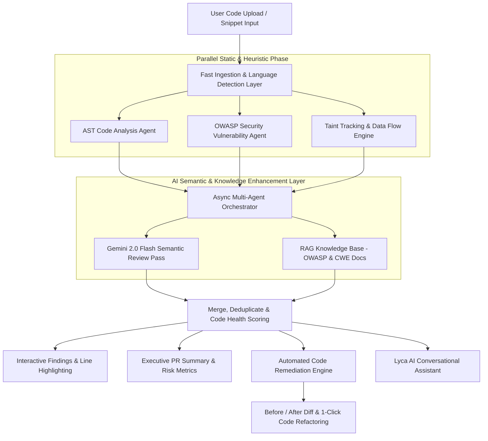

# 🛡️ Smart Code Inspection Platform with Multi-Agent Vulnerability Detection System

[](https://fastapi.tiangolo.com)
[](https://reactjs.org)
[](https://vitejs.dev)
[](https://ai.google.dev)
[](https://www.python.org)
[](https://opensource.org/licenses/MIT)

An enterprise-grade, multi-agent AI platform engineered to automatically scan, analyze, score, and refactor source code. Powered by specialized static AST analyzers, OWASP Top 10 security agents, real-time taint tracking, and Google Gemini 2.0 LLMs, the platform delivers sub-second automated security reviews, interactive diffs, 1-click full code remediation, and conversational AI assistance.

---

## 🌐 Live Deployments

- **Live Web Application**: [https://ai-code-review-security-analysis-ag.vercel.app](https://ai-code-review-security-analysis-ag.vercel.app)
- **Backend API**: Hosted on high-performance containerized cloud infrastructure.

---

## 🏗️ Multi-Agent Architecture & Execution Pipeline

The platform operates on a synchronized, multi-tiered pipeline where specialized autonomous agents collaborate in strict sequence to evaluate and remediate uploaded code.



---

## 🔄 Multi-Agent Workflow: Step-by-Step Order of Operations

### **Step 1: Ingestion & Language Classification**
* When a user uploads a file (`.py`, `.java`, `.js`, `.ts`, `.cpp`, `.c`, `.sql`) or pastes raw code into the Monaco-based IDE workspace, the platform validates syntax and sets language-specific parsing rules.

### **Step 2: Parallel Static AST & Security Inspection**
* **Code Analysis Agent**: Parses the Concrete Syntax Tree (via Python `ast.parse` and regex lexers) to compute complexity metrics, god functions (>50 lines), excessive parameter lists (>5 args), mutable defaults, dead code, and maintainability anti-patterns.
* **Security Vulnerability Agent**: Performs heuristic scanning against the OWASP Top 10:2021 database for:
  * **SQL Injection (CWE-89)**: Unparameterized string concatenations, f-strings, and unescaped queries.
  * **OS Command Injection (CWE-78)**: Dangerous system calls (`os.system`, `subprocess(shell=True)`, `Runtime.exec`).
  * **Hardcoded Credentials & Secrets (CWE-798)**: Plaintext API keys, JWT secrets, passwords, and private keys.
  * **Insecure Deserialization (CWE-502)**: Unsafe object loaders (`yaml.load`, `pickle.loads`).
  * **Arbitrary Code Execution (CWE-95)**: Dynamic code evaluation (`eval()`, `exec()`).
  * **Cross-Site Scripting - XSS (CWE-79)**: Raw DOM manipulation (`innerHTML`, unescaped `render_template_string`).
  * **Security Misconfigurations (CWE-16)**: `DEBUG = True`, `verify = False` (disabled SSL), wildcard `ALLOWED_HOSTS`.
  * **Error Handling Deficiencies (CWE-391)**: Bare `except:` clauses that suppress critical failures.
* **Taint Tracking Engine**: Maps the flow of untrusted user inputs (`request.args`, `getParameter`, `sys.argv`) directly into vulnerable execution sinks.

### **Step 3: AI Semantic Augmentation Layer**
* Leverages Google Gemini 2.0 Flash via async non-blocking execution (`httpx.AsyncClient`) with connection pooling and strict timeouts.
* Augments static detections with deep contextual insights, detecting complex multi-file logic flaws and edge-case security risks.

### **Step 4: Merge, Scoring & Code Health Normalization**
* Deduplicates findings from all agents and calculates an objective **Code Health Score (0–100)**:
  $$\text{Health Score} = \max(0, 100 - (25 \times \text{Critical}) - (15 \times \text{High}) - (5 \times \text{Medium}) - (2 \times \text{Low}))$$
* Categorizes overall project risk: **Critical**, **High**, **Medium**, or **Low**.

### **Step 5: Automated Code Remediation Engine (`/fix-all` & `/remediate`)**
* Refactors code to eliminate 100% of detected vulnerabilities without human intervention.
* Automatically injects necessary secure imports (`import os`, `import subprocess`, `import ast`, `import logging`, `from markupsafe import escape`).
* Replaces hardcoded secrets with `os.getenv()` / `System.getenv()`, parameterizes SQL queries (`PreparedStatement` / `?` tuples), wraps commands in safe argument arrays with `shell=False`, and escapes template strings.

### **Step 6: Conversational Assistant & RAG (Lyca AI)**
* An embedded AI pair programmer powered by Retrieval-Augmented Generation (RAG) loaded with OWASP guidelines and CWE catalogs.
* Understands the exact code submitted, explains detected findings line by line, and generates custom refactored code on demand.

### **Step 7: Automated PR Summary & Audit Reporting**
* Generates comprehensive Pull Request (PR) review summaries including executive risk overviews, severity breakdowns, prioritized fix lists, estimated remediation time, and exportable Markdown audit reports.

---

## ✨ Complete Website & Platform Features

| Feature | Description |
| :--- | :--- |
| **Interactive Code Studio** | Multi-language code editor with syntax highlighting, line numbers, and sample vulnerability presets. |
| **Instant Real-Time Analysis** | Ultra-fast scan engine delivering full multi-agent review in **under 1 second**. |
| **Interactive Findings Explorer** | Filter findings by severity (*Critical, High, Medium, Low*), view exact line numbers, and inspect remediation details. |
| **1-Click "Generate Fixed Code"** | Instantly produces a fully refactored, secure version of the entire uploaded codebase. |
| **Side-by-Side Diff Viewer** | Split-screen visual diff highlighting exact lines changed, added, or removed. |
| **Lyca AI Chatbot** | Conversational assistant supporting Floating Popup, Split Screen, and Fullscreen modes. |
| **Executive PR Summary Dashboard** | Generates audit-ready reports, code health gauges, and structured mitigation roadmaps. |
| **Scan History & Persistence** | Saves previous scans in browser `localStorage` for immediate recall and comparison. |
| **Exportable Reports** | Download full review findings as structured Markdown or JSON reports for CI/CD integration. |

---

## 🎯 OWASP Top 10 Vulnerability Coverage Matrix

| OWASP Category | Vulnerability Type | Detection Mechanism | Automated Remediation |
| :--- | :--- | :--- | :--- |
| **A01: Broken Access Control** | Path Traversal / SSRF | Pattern & AI Semantic | Path sanitization & IP validation |
| **A02: Cryptographic Failures** | Weak Hash (MD5/SHA-1), Hardcoded Keys | AST & Regex Scanner | SHA-256 upgrade & `os.getenv` extraction |
| **A03: Injection** | SQLi, Command Injection, XSS, `eval()` | Taint Tracker & AST | Parameterized queries, `subprocess.run(list)`, `escape()` |
| **A05: Security Misconfiguration** | Debug Mode, Disabled SSL (`verify=False`) | Heuristic Scanner | `DEBUG = False`, `verify = True`, strict hosts |
| **A07: Identification & Auth** | Hardcoded Passwords, Tokens, API Keys | Entropy & AST Assign | Environment variable configuration (`os.getenv`) |
| **A08: Software & Data Integrity** | Insecure Deserialization (`pickle`, `yaml`) | AST Sink Matcher | `yaml.safe_load()`, `json.loads()` replacement |
| **A09: Logging & Monitoring** | Bare `except:`, Silent Failures | AST Exception Handler | `except Exception as e:` with `logging.error()` |

---

## 🛠️ Technology Stack

### **Frontend**
- **Framework**: React 19, Vite
- **Styling**: Tailwind CSS & Modern Glassmorphism CSS Design Tokens
- **Icons**: Material Symbols, Lucide React
- **Markdown & Code Rendering**: ReactMarkdown, RemarkGfm, PrismJS / Monaco Editor syntax styling

### **Backend**
- **Framework**: FastAPI (Python 3.11+)
- **Async Runtime**: Uvicorn, `asyncio`, `httpx.AsyncClient`
- **AI / LLM Integration**: Google Gemini 2.0 Flash (`google-genai`), Groq API fallback
- **Static Analysis**: Python `ast`, Regex Lexing, Taint Tracking Engine
- **Data Validation**: Pydantic v2

---

## 🚀 Local Setup and Installation

### Prerequisites
- **Python 3.11+** installed
- **Node.js 20+** installed
- A **Google Gemini API Key** ([Get your key here](https://aistudio.google.com/))

---

### 1. Backend Setup

```powershell
# Clone the repository
git clone https://github.com/Rafi0496/AI-Code-Review-Security-Analysis-Agent.git
cd "AI-Code-Review-Security-Analysis-Agent"

# Install backend dependencies
pip install -r ai_code_review/requirements.txt

# Create your .env file
echo "GEMINI_API_KEY=your_actual_gemini_api_key_here" > .env

# Start the FastAPI backend server
uvicorn ai_code_review.main:app --reload --port 8000
```
> The API will be active at `http://localhost:8000` (Swagger docs at `http://localhost:8000/docs`).

---

### 2. Frontend Setup

```powershell
# Open a new terminal and navigate to the frontend folder
cd frontend

# Install Node dependencies
npm install

# Start the Vite development server
npm run dev
```
> The web interface will open at `http://localhost:5173`.

---

## 📡 Key API Endpoints

| Method | Endpoint | Description |
| :--- | :--- | :--- |
| `POST` | `/analyze/text` | Runs the full multi-agent static & semantic analysis on raw code. |
| `POST` | `/analyze/file` | Accepts multi-language file uploads for analysis. |
| `POST` | `/fix-all` | Generates a complete, remediated, production-ready codebase. |
| `POST` | `/remediate` | Returns structured JSON fix details for an individual finding. |
| `POST` | `/chat` | Context-aware AI assistant answering code & security queries. |
| `POST` | `/pr-summary` | Generates executive audit metrics and PR summaries. |
| `GET` | `/health` | System health check and API status endpoint. |

---

## 📁 Repository Structure

```text
.
├── ai_code_review/
│   ├── main.py                     # Unified FastAPI server & agent router
│   ├── requirements.txt            # Python backend dependencies
│   ├── verify.py                   # Automated regression test suite (25 test cases)
│   ├── agents/                     # Specialized agent modules
│   │   ├── code_analysis_agent.py  # AST code quality & complexity analyzer
│   │   ├── security_agent.py       # OWASP vulnerability detection agent
│   │   ├── remediation_agent.py    # Automated refactoring & fix generator
│   │   ├── pr_summary_agent.py     # PR summary & audit report generator
│   │   └── orchestrator.py         # Multi-agent workflow orchestrator
│   ├── modules/
│   │   ├── taint_tracker.py        # Source-to-sink taint analysis engine
│   │   └── rag_pipeline.py         # Knowledge-base retrieval pipeline
│   └── knowledge_base/             # OWASP & CWE security reference catalogs
│
├── frontend/
│   ├── src/
│   │   ├── App.jsx                 # Master application component & tab coordinator
│   │   ├── main.jsx                # React DOM entry point
│   │   ├── api/client.js           # API client for backend integration
│   │   ├── components/             # Reusable UI components & modals
│   │   ├── pages/                  # Route views (Workspace, Review, PR Summary, Chat)
│   │   └── styles/index.css        # Premium glassmorphism design system
│   ├── package.json                # Frontend dependencies
│   └── vite.config.js              # Vite bundler configuration
│
├── samples/                        # Pre-configured test benchmark files
│   ├── 1_basic_injection.py        # SQLi, secrets, bare except test
│   ├── 2_complex_auth.java         # Java SQLi, credential constant, printStackTrace test
│   └── 3_advanced_vulns.py         # Command injection, YAML deserialization, XSS test
│
└── README.md                       # Master project documentation
```

---

## 🧪 Verification & Testing

To run the automated 25-point regression test suite:

```powershell
python ai_code_review/verify.py
```

Expected output:
```text
==================================================
  Results: 25 passed, 0 failed
==================================================
```

---

## 📜 License

Distributed under the **MIT License**. See `LICENSE` for more information.
