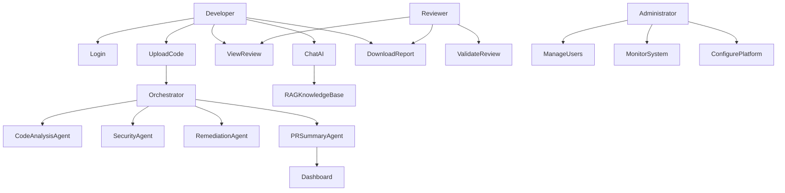

# AI Code Review & Security Analysis Agent
## Volume 01 – Project Foundation

---

**Project:** AI Code Review & Security Analysis Agent
**Document Type:** Implementation Guide
**Volume:** 01 – Project Foundation
**Version:** 1.0
**Status:** Final
**Prepared For:** Academic Capstone Project
**Prepared By:** Project Development Team

**Technology Stack**
- Google Agent Development Kit (ADK)
- Google Gemini
- FastAPI
- React (Vite)
- PostgreSQL
- ChromaDB
- Docker
- GitHub

---

# Revision History

| Version | Date | Author | Description |
|---------|------|--------|-------------|
| 0.1 | Initial Draft | Project Team | Initial structure |
| 1.0 | Current | Project Team | Volume 1 Final |

---

# Table of Contents

1. Executive Summary
2. Project Overview
3. Problem Statement
4. Existing System Analysis
5. Proposed System
6. Project Objectives
7. Project Scope
8. Stakeholders
9. Assumptions
10. Constraints
11. Success Criteria
12. Functional Requirements
13. Non-Functional Requirements
14. User Roles
15. Use Cases
16. Use Case Diagram
17. User Stories
18. User Story Acceptance Criteria
19. User Story Prioritization
20. User Journey
21. Requirement Traceability Matrix (RTM)
22. Glossary
23. Acronyms
24. References
25. Standards and Compliance
26. Document Summary
27. Volume 1 Conclusion

---

# 1. Executive Summary

## 1.1 Introduction

Software quality is one of the most critical factors influencing the reliability, maintainability, and security of modern software systems. The **AI Code Review & Security Analysis Agent** addresses manual review challenges by introducing an intelligent multi-agent architecture performing automated code analysis, security vulnerability detection, remediation guidance, pull request summarization, and conversational developer assistance.

## 1.2 Purpose

Design and implement an intelligent AI-assisted code review platform automating key peer review activities while improving software quality, security, and development velocity.

## 1.3 Vision Statement

To provide an intelligent, scalable, and secure AI-powered code review platform that assists software developers in producing high-quality, maintainable, and secure code through automated analysis and actionable recommendations.

## 1.4 Mission Statement

Develop a multi-agent AI system capable of performing automated source code analysis, detecting security vulnerabilities, suggesting secure remediation strategies, generating pull request summaries, and assisting developers through natural language conversations.

## 1.5 Expected Outcomes

- Automated code quality assessment
- Security vulnerability identification aligned with OWASP
- AI-generated remediation recommendations
- Automated pull request summaries
- Interactive developer assistance through conversational AI
- Centralized reporting dashboard
- Knowledge retrieval using Retrieval-Augmented Generation (RAG)
- Modular multi-agent architecture supporting future expansion

---

# 2. Project Overview

The AI Code Review & Security Analysis Agent combines LLMs, RAG, and a Multi-Agent architecture to perform comprehensive source code analysis. The system adopts the **Google Agent Development Kit (ADK)** as the orchestration framework, with FastAPI backend, React frontend, PostgreSQL for persistence, and ChromaDB for vector storage.

---

# 3. Problem Statement

## 3.1 Existing Challenges

- **Manual Review Overhead** — Experienced developers spend substantial time reviewing source code
- **Inconsistent Review Quality** — Different reviewers identify different issues
- **Security Vulnerabilities** — SQL Injection, XSS, Command Injection, Hardcoded Secrets, Insecure Authentication
- **Knowledge Silos** — Junior developers depend on senior engineers for explanations
- **Limited Scalability** — Manual processes cannot scale with growing repositories
- **Delayed Feedback** — Long review cycles slow software delivery

## 3.2 Problem Definition

The absence of intelligent, automated code review results in increased development effort, longer review cycles, higher maintenance costs, increased security vulnerabilities, inconsistent coding standards, and reduced developer productivity.

---

# 4. Existing System Analysis

## 4.1 Limitations of Existing Systems

| Limitation | Description |
|------------|-------------|
| Time Consuming | Manual reviews require significant developer effort |
| Human Error | Reviewers may overlook defects or vulnerabilities |
| Subjective Feedback | Review quality varies between reviewers |
| Limited Security Expertise | Not all reviewers possess security knowledge |
| Lack of Knowledge Retention | Review insights are rarely reused efficiently |
| Scalability Issues | Large repositories require extensive review resources |

## 4.2 Gap Analysis

| Existing Practice | Proposed AI Solution |
|-------------------|----------------------|
| Manual code inspection | Automated AI-driven analysis |
| Human-only feedback | AI-assisted recommendations with human validation |
| Reviewer knowledge | Centralized knowledge retrieval using RAG |
| Manual security review | Dedicated Security Analysis Agent |
| Manual documentation | Automated Pull Request Summary Agent |
| Limited guidance | Conversational AI Assistant |

---

# 5. Proposed System

## 5.1 System Overview

The platform introduces a modular Multi-Agent architecture coordinating:

- Code Submission Module
- Code Analysis Agent (Google ADK + Gemini)
- Security Vulnerability Agent (Google ADK + Gemini)
- Remediation Recommendation Agent (Google ADK + Gemini)
- Pull Request Summary Agent (Google ADK + Gemini)
- Secure Knowledge Base (ChromaDB + RAG)
- Conversational Assistant (RAG-powered)
- Findings Dashboard (React)
- Report Generation Module (PDF/Markdown)

## 5.2 High-Level Workflow

1. Developer submits source code via portal
2. Code validated and stored in PostgreSQL
3. Orchestration layer (ADK SequentialAgent) distributes work
4. Code Analysis Agent evaluates code quality
5. Security Agent scans for vulnerabilities
6. Remediation Agent generates recommendations
7. PR Summary Agent compiles findings
8. Knowledge Base provides contextual guidance via RAG
9. Dashboard aggregates results
10. Developer reviews recommendations and generates reports

---

# 6. Project Objectives

| ID | Objective | Expected Outcome |
|----|-----------|-----------------|
| OBJ-01 | Automated Code Quality Assessment | Improved readability, consistent standards |
| OBJ-02 | Security Vulnerability Detection | Earlier detection, reduced security risk |
| OBJ-03 | Intelligent Remediation | Faster issue resolution, developer learning |
| OBJ-04 | AI-Based PR Summarization | Faster review process |
| OBJ-05 | Conversational Developer Assistance | Reduced learning curve, improved productivity |
| OBJ-06 | Knowledge Retrieval (RAG) | Accurate AI responses, reduced hallucinations |
| OBJ-07 | Reporting and Analytics | Better visibility, historical tracking |

---

# 7. Project Scope

## 7.2 In Scope

- Source code upload (Python, Java, JavaScript, TypeScript)
- Multi-agent AI pipeline (ADK + Gemini)
- RAG knowledge base (OWASP, secure coding docs)
- Findings dashboard with severity scoring
- Report generation (PDF, Markdown)
- Role-based access control (Admin, Developer, Reviewer)
- PostgreSQL + ChromaDB persistence

## 7.3 Out of Scope

- Automatic code merging or deployment
- CI/CD server implementation
- Mobile applications
- IDE plugin development
- Enterprise identity federation
- Multi-cloud deployment automation

---

# 8. Stakeholders

| Stakeholder | Role | Responsibilities |
|-------------|------|-----------------|
| Developers | End User | Submit code, review findings, apply recommendations |
| Project Supervisor | Academic Reviewer | Evaluate quality and implementation |
| Development Team | System Builder | Design, implement, test, maintain |
| Reviewers | Quality Assurance | Validate AI findings, add comments |
| System Administrator | Platform Management | Manage users, permissions, configuration |

---

# 9. Assumptions

**Technical:** Google ADK provides reliable orchestration; Gemini models remain available; FastAPI, React, PostgreSQL, ChromaDB remain compatible.

**Operational:** Users possess basic development knowledge; source code submitted is syntactically valid; network connectivity is available.

---

# 10. Constraints

| Category | Constraints |
|----------|------------|
| Technical | AI model latency, API limits, LLM context windows, storage |
| Academic | Limited duration, submission deadlines, demonstration requirements |
| Security | Source code protection, API credential security, RBAC enforcement |
| Financial | Open-source tooling, educational API tiers |

---

# 11. Success Criteria

**Functional:** AI agents analyze submitted code; vulnerabilities detected; remediation generated; PR summaries produced; assistant answers queries.

**Quality:** Stable performance; accurate AI responses; modular architecture; secure data handling; clear reports.

**Academic:** Demonstrates Multi-Agent AI; applies RAG effectively; follows software engineering best practices; comprehensive documentation.

---

# 12. Functional Requirements

## 12.1 Module Categories

| Module ID | Module Name |
|-----------|-------------|
| FR-100 | User Management |
| FR-200 | Authentication & Authorization |
| FR-300 | Code Submission |
| FR-400 | AI Code Analysis |
| FR-500 | Security Analysis |
| FR-600 | Remediation Recommendation |
| FR-700 | Pull Request Summary |
| FR-800 | Knowledge Base (RAG) |
| FR-900 | Conversational AI Assistant |
| FR-1000 | Dashboard & Reporting |
| FR-1100 | Administration |

## 12.2 Requirements Summary

| ID | Requirement | Priority |
|----|-------------|----------|
| FR-101 | User Registration | High |
| FR-102 | User Login | High |
| FR-103 | User Profile Management | Medium |
| FR-201 | Secure Authentication (JWT) | High |
| FR-202 | Role-Based Access Control | High |
| FR-203 | Session Management | High |
| FR-301 | Code Upload (file/paste) | High |
| FR-302 | Supported Languages: Python, Java, JS, TS | High |
| FR-303 | Source Code Validation | High |
| FR-401 | Code Quality Analysis | High |
| FR-402 | Code Smell Detection | High |
| FR-403 | Maintainability Assessment | Medium |
| FR-501 | Vulnerability Detection (OWASP) | High |
| FR-502 | Severity Classification | High |
| FR-503 | Security Explanation | High |
| FR-601 | AI Recommendations | High |
| FR-602 | Sample Code Generation | High |
| FR-701 | Automatic PR Summary | Medium |
| FR-702 | Review Statistics | Medium |
| FR-801 | Retrieval-Augmented Generation | High |
| FR-802 | Knowledge Sources (OWASP, CERT) | Medium |
| FR-901 | AI Chat Interface | High |
| FR-902 | Context Awareness | High |
| FR-1001 | Dashboard Display | High |
| FR-1002 | Report Export (PDF, Markdown) | Medium |
| FR-1101 | User Management (Admin) | High |
| FR-1102 | System Monitoring | Medium |

---

# 13. Non-Functional Requirements

| ID | Category | Requirement |
|----|----------|-------------|
| NFR-001 | Performance | Review response within acceptable processing time |
| NFR-002 | Performance | Support concurrent users without degradation |
| NFR-003 | Reliability | Graceful failure recovery, data consistency |
| NFR-004 | Security | JWT auth, bcrypt hashing, RBAC, HTTPS |
| NFR-005 | Usability | Intuitive interface, meaningful error messages |
| NFR-006 | Maintainability | Modular, documented, extensible, testable |
| NFR-007 | Portability | Docker container deployment |
| NFR-008 | Scalability | Architecture supports additional agents and languages |

---

# 14. User Roles

| Role | Key Permissions |
|------|----------------|
| Administrator | Full access: user management, system config, audit logs |
| Developer | Submit code, view findings, AI chat, download reports |
| Reviewer | View/validate reviews, add comments, approve findings |

---

# 15. Use Cases

| UC ID | Use Case | Primary Actor |
|-------|----------|---------------|
| UC-01 | User Authentication | User |
| UC-02 | Submit Source Code | Developer |
| UC-03 | AI Code Review | Code Analysis Agent |
| UC-04 | Security Analysis | Security Agent |
| UC-05 | Generate Recommendations | Remediation Agent |
| UC-06 | Generate PR Summary | PR Summary Agent |
| UC-07 | Conversational Assistant | Developer |
| UC-08 | Download Report | Developer/Reviewer |
| UC-09 | Manage Users | Administrator |

---

# 16. Use Case Diagram



---

# 17. User Stories

| ID | Story | Priority |
|----|-------|----------|
| US-001 | As a user, I want to securely log in | Must Have |
| US-002 | As an admin, I want to manage users | Must Have |
| US-003 | As a developer, I want to upload source code | Must Have |
| US-004 | As a developer, I want AI to detect coding issues | Must Have |
| US-005 | As a developer, I want security vulnerabilities identified | Must Have |
| US-006 | As a developer, I want recommended fixes | Must Have |
| US-007 | As a developer, I want to ask questions about findings | Should Have |
| US-008 | As a reviewer, I want AI-generated summaries | Should Have |
| US-009 | As a developer, I want downloadable reports | Should Have |
| US-010 | As an admin, I want system statistics | Should Have |

---

# 18. User Story Acceptance Criteria

| Story | Acceptance Criteria |
|-------|---------------------|
| US-001 | User successfully logs in with valid credentials; invalid credentials rejected |
| US-002 | Administrator creates, updates, disables users and assigns roles |
| US-003 | Code upload succeeds; file validated for language and size |
| US-004 | AI returns structured quality findings with descriptions |
| US-005 | Vulnerabilities detected with severity classification |
| US-006 | Recommendations include corrective action and code examples |
| US-007 | AI assistant answers questions with review and RAG context |
| US-008 | Pull request summary generated with statistics |
| US-009 | Report downloads successfully as PDF or Markdown |
| US-010 | Dashboard displays review counts, severity breakdown, agent status |

---

# 19. User Story Prioritization (MoSCoW)

| Priority | Stories |
|----------|---------|
| Must Have | US-001 to US-006 |
| Should Have | US-007 to US-010 |
| Could Have | GitHub Integration, IDE Plugin, Email Notifications |
| Future Release | CI/CD Integration, Enterprise SSO, Mobile App |

---

# 20. User Journey

## Developer Journey
```
Login → Select Project → Upload Source Code →
AI Multi-Agent Analysis (Quality / Security / Recommendations / PR Summary) →
Dashboard → Ask AI Questions → Download Report → Logout
```

## Reviewer Journey
```
Login → Open Review → Inspect AI Findings →
Validate Recommendations → Add Comments → Approve → Generate Report
```

## Administrator Journey
```
Login → System Dashboard →
Monitor AI Agents | Manage Users | View Reports | Audit Logs | Configure Platform
```

---

# 21. Requirement Traceability Matrix (RTM)

| Req ID | Requirement | Use Case | User Story | Agent/Module | Test ID |
|--------|-------------|----------|------------|--------------|---------|
| FR-101 | User Registration | UC-01 | US-001 | Auth API | TC-001 |
| FR-102 | User Login | UC-01 | US-001 | Auth API | TC-002 |
| FR-201 | JWT Authentication | UC-01 | US-001 | core/security.py | TC-003 |
| FR-202 | RBAC | All UCs | All USs | core/security.py | TC-004 |
| FR-301 | Code Upload | UC-02 | US-003 | submissions.py | TC-010 |
| FR-302 | Language Support | UC-02 | US-003 | submissions.py | TC-011 |
| FR-303 | Code Validation | UC-02 | US-003 | submissions.py | TC-012 |
| FR-401 | Code Quality Analysis | UC-03 | US-004 | code_analysis_agent.py | TC-020 |
| FR-402 | Code Smell Detection | UC-03 | US-004 | code_analysis_agent.py | TC-021 |
| FR-501 | Vulnerability Detection | UC-04 | US-005 | security_agent.py | TC-030 |
| FR-502 | Severity Classification | UC-04 | US-005 | security_agent.py | TC-031 |
| FR-601 | AI Recommendations | UC-05 | US-006 | remediation_agent.py | TC-040 |
| FR-602 | Code Generation | UC-05 | US-006 | remediation_agent.py | TC-041 |
| FR-701 | PR Summary | UC-06 | US-008 | pr_summary_agent.py | TC-050 |
| FR-801 | RAG Pipeline | UC-07 | US-007 | knowledge_base.py | TC-060 |
| FR-901 | AI Chat | UC-07 | US-007 | chat.py | TC-070 |
| FR-1001 | Dashboard | All UCs | US-010 | React Dashboard | TC-080 |
| FR-1002 | Report Export | UC-08 | US-009 | report_service.py | TC-090 |
| FR-1101 | User Management | UC-09 | US-002 | admin.py | TC-100 |

---

# 22. Glossary

| Term | Definition |
|------|------------|
| Agent | An autonomous software component that performs a specific analysis task using AI |
| ADK | Google Agent Development Kit — framework for building multi-agent AI systems |
| ChromaDB | Open-source vector database used for storing document embeddings for RAG |
| Code Smell | A symptom in source code indicating potential design or quality issues |
| Embedding | A numerical vector representation of text for semantic similarity search |
| Finding | A specific issue detected by an AI agent during code review |
| Gemini | Google's family of multimodal large language models |
| LLM | Large Language Model — AI model trained on large text corpora for natural language tasks |
| OWASP | Open Web Application Security Project — organization defining web security standards |
| Orchestrator | Component that coordinates the execution of multiple specialized AI agents |
| RAG | Retrieval-Augmented Generation — technique combining document retrieval with AI generation |
| Remediation | Corrective action recommended to fix a detected code or security issue |
| Severity | Classification of a finding's risk level (Critical, High, Medium, Low, Informational) |
| Vector Store | Database optimized for storing and querying high-dimensional embedding vectors |

---

# 23. Acronyms

| Acronym | Full Form |
|---------|-----------|
| ADK | Agent Development Kit |
| AI | Artificial Intelligence |
| API | Application Programming Interface |
| CERT | Computer Emergency Response Team |
| CORS | Cross-Origin Resource Sharing |
| CSRF | Cross-Site Request Forgery |
| CWE | Common Weakness Enumeration |
| DB | Database |
| ER | Entity-Relationship |
| FR | Functional Requirement |
| HTTP | Hypertext Transfer Protocol |
| HTTPS | Hypertext Transfer Protocol Secure |
| JWT | JSON Web Token |
| LLM | Large Language Model |
| MVP | Minimum Viable Product |
| NFR | Non-Functional Requirement |
| ORM | Object-Relational Mapping |
| OWASP | Open Web Application Security Project |
| RBAC | Role-Based Access Control |
| RAG | Retrieval-Augmented Generation |
| REST | Representational State Transfer |
| RTM | Requirement Traceability Matrix |
| SQL | Structured Query Language |
| UC | Use Case |
| US | User Story |
| XSS | Cross-Site Scripting |

---

# 24. References

| # | Reference |
|---|-----------|
| 1 | OWASP Top 10 — https://owasp.org/www-project-top-ten/ |
| 2 | Google Agent Development Kit — https://google.github.io/adk-docs/ |
| 3 | Google Gemini API — https://ai.google.dev/ |
| 4 | FastAPI Documentation — https://fastapi.tiangolo.com/ |
| 5 | ChromaDB Documentation — https://docs.trychroma.com/ |
| 6 | CERT Secure Coding Standards — https://wiki.sei.cmu.edu/ |
| 7 | CWE/SANS Top 25 — https://cwe.mitre.org/ |
| 8 | React Documentation — https://react.dev/ |
| 9 | SQLAlchemy Documentation — https://docs.sqlalchemy.org/ |
| 10 | Docker Documentation — https://docs.docker.com/ |

---

# 25. Standards and Compliance

| Standard | Application |
|----------|-------------|
| OWASP Top 10 | Security vulnerability detection categories |
| CERT Secure Coding | Remediation recommendations baseline |
| ISO/IEC 25010 | Software quality model reference |
| PEP 8 | Python code quality standards |
| Google Java Style Guide | Java code quality standards |
| JWT RFC 7519 | Authentication token standard |
| OpenAPI 3.0 | REST API documentation standard |

---

# 26. Document Summary

Volume 01 — Project Foundation establishes the complete foundational documentation for the AI Code Review & Security Analysis Agent. It defines:

- **Problem context** — manual review limitations and security gaps
- **Proposed solution** — five-agent multi-agent pipeline with RAG
- **27 functional requirements** across 11 modules
- **8 non-functional requirements** covering performance, security, usability
- **3 user roles** with RBAC permissions
- **9 use cases** covering the full workflow
- **10 user stories** with acceptance criteria and MoSCoW prioritization
- **RTM** mapping all requirements to use cases, agents, and test cases
- **Glossary, acronyms, and references** for complete documentation coverage

---

# 27. Volume 1 Conclusion

Volume 01 establishes the complete project foundation for the AI Code Review & Security Analysis Agent. The documented requirements, user roles, use cases, and traceability matrix provide the baseline from which all subsequent architecture, implementation, and testing volumes are derived.

The next volumes will cover:
- **Volume 02** — System Architecture & Database Design
- **Volume 03** — Backend Implementation (ADK Agents, FastAPI, RAG)
- **Volume 04** — Frontend Implementation (React Developer Portal)
- **Volume 05** — Testing, Deployment & Evaluation

---

*End of Volume 01 — Project Foundation*
*AI Code Review & Security Analysis Agent*
*Version 1.0 — Final*
